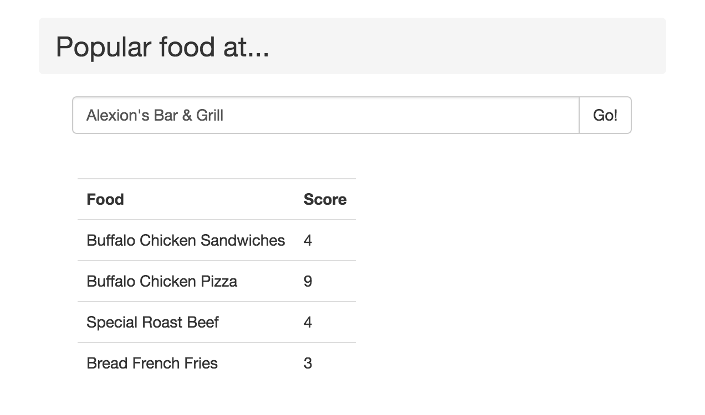

# About MiningYelp
This project runs python scripts to extract foodnames from yelp restaurant reviews and picks out the most popular foods to recommend to user (via a web app).

## Demo
http://dhiviyad.96.lt/webapp/popular_foods.php

## Screenshots

## Tech Stack
HTML, Jquery, Javascript, CSS, MySQL for the Web App  
Python, Shell Scripts for the code text-mining algorithms

## Testing
To test the algorithm, run demo1.py. You can modify the review text string in the file to test the algorithm for different restaurant reviews.

## Documentation
https://github.com/dhiviyadhanasekar/MiningYelp/blob/master/Mining%20Popular%20Foods%20From%20Restaurants.pdf
